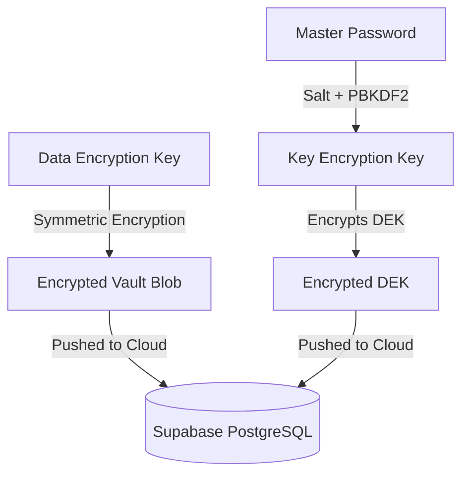

# Personal Dashboard Extension - Complete Architecture Detail

## 1. System Overview

The Personal Dashboard is a Manifest V3 Chrome Extension that functions as a lightweight, offline-first Single Page Application (SPA). It provides users with a comprehensive toolset for saving links, taking notes, managing passwords, and storing files, all synced cross-device via a secure cloud backend.

### 1.1 Core Components
*   **Service Worker (`background.js`)**: The persistent background script. It handles extension lifecycle events, manages context menus ("Add to Dashboard"), and initiates background data synchronization without blocking the main UI thread.
*   **Extension Pages (`popup.html`, `password_manager.html`)**: The interactive user interfaces. These pages use a custom vanilla JavaScript router (`core/router.js`) to switch between views (Dashboard, Notes Mode, Vault mode, Settings).
*   **Content Scripts (`password-manager/content.js`, `save_prompt.js`)**: Injected into every webpage the user visits. They discretely monitor for login forms, capture credentials upon submission, and inject a custom UI overlay to prompt the user to save their passwords. They also handle autofilling saved credentials.
*   **External Auth Page (`auth-page/`)**: A separate web project designed to be hosted remotely (e.g., on Vercel). This page leverages Supabase Auth UI to handle complex flows like OAuth (Google/GitHub) and Magic Links securely, passing the resulting session tokens securely back to the local extension.

---

## 2. Storage Architecture

The architecture relies on a hybrid "Offline-First" model. The local database is the single source of truth for immediate operations, ensuring zero latency, while the cloud acts as a syncing medium and backup.

### 2.1 Local Storage (IndexedDB)
The extension uses the browser's IndexedDB engine, managed gracefully through `core/db.js` (`PersonalDashboardDB`).
*   **Identifier System**: Instead of auto-incrementing integers, all records use **UUIDs (Universally Unique Identifiers)**. This prevents key collisions when merging data edited on two different laptops simultaneously.
*   **Data Stores**:
    *   `folders`: Holds hierarchical folder data.
    *   `items` / `notes`: Stores text notes, captured links, and uploaded files. Binary data (images/files) is stored as Blobs directly within IndexedDB locally.
    *   `vault`: Stores password entries in an encrypted format.
    *   `settings`: User interface preferences and sync toggles.
    *   `tombstones`: Crucial for tracking deleted items (explained in Sync).

### 2.2 Cloud Storage (Supabase PostgreSQL)
Supabase provides the remote syncing infrastructure. The `supabase_schema.sql` defines the cloud topology, heavily utilizing Row Level Security (RLS) to ensure users can only ever access their own data.
*   **Core Tables (4 total)**:
    *   `profiles`: User metadata, premium status, vault keys (EDEK envelope), encrypted vault blob, and synced settings — all consolidated into a single row per user.
    *   `folders`: Hierarchical folder structure with UUID primary keys and self-referencing `parent_id` foreign key.
    *   `notes`: All note items (text, links, files) with UUID primary keys and a foreign key to `folders`.
    *   `tombstones`: Tracks deleted entities with `entity_id` and `entity_type` (note/folder) for reliable cross-device deletion sync.
*   **Zero-Knowledge Columns** (on `profiles`):
    *   `encrypted_vault`: The entire password vault stored as a single, opaque JSONB blob. Supabase cannot parse its contents.
    *   `vault_salt`, `vault_edek`, `vault_edek_iv`, `vault_validator`, `vault_validator_iv`: Cryptographic envelope for the Encrypted Data Encryption Key (EDEK).
*   **Storage API**: The `user-files` S3-compatible bucket is used to store larger attachments backing the notes.

---

## 3. Synchronization & Conflict Engine

The `core/sync.js` module is a custom synchronization engine built to prevent data loss in a distributed environment.

### 3.1 Optimistic Concurrency Control (OCC)
Both local and cloud records are assigned a `version` integer.
*   When a user modifies a note locally, its `version` increments, and a push is triggered.
*   If the cloud's `version` is strictly greater than the payload's `version`, a conflict has occurred (i.e., another device already modified this record).
*   The sync engine detects this and applies logical conflict resolution, generally defaulting to a "latest `updated_at` wins" approach to merge the most recent data safely.

### 3.2 Tombstone Deletions
Hard-deleting a row locally breaks synchronization because another device won't know it was deleted (and might just re-upload it to the cloud).
*   Instead of hard deletes, the extension creates a **Tombstone** record containing the UUID of the deleted item.
*   During a sync cycle, a device pulls all new tombstones from Supabase and subsequently scrubs its local IndexedDB of any item matching those UUIDs.

### 3.3 Supabase Realtime
To achieve instantaneous updates (like Google Docs), the extension subscribes to Supabase's Realtime WebSocket connections. When Device A saves a note, Supabase fires a broadcast event. Device B receives this ping and immediately executes a localized pull to fetch the changes.

---

## 4. Zero-Knowledge Cryptographic Architecture

The password manager (`password-manager/`) is designed with strict Zero-Knowledge principles using the built-in **Web Crypto API** (`crypto.js`), ensuring complete data privacy even in the event of a cloud breach.

### 4.1 Key Entities
1.  **Master Password**: The user's secret phrase. It is never stored locally or transmitted to the cloud.
2.  **Key Encryption Key (KEK)**: Derived directly from the Master Password using rigorous key-stretching (like PBKDF2/Argon2) combined with a unique salt. It exists entirely in ephemeral browser memory.
3.  **Data Encryption Key (DEK)**: A highly randomized symmetric key generated once. It is the only key used to rapidly encrypt/decrypt the actual `vault_data` blob.
4.  **Encrypted DEK (EDEK)**: To allow a user to log in on a new device without exposing their Master Password, the DEK is encrypted using the KEK to produce the EDEK. The cloud stores this EDEK safely.

### 4.2 The Cryptographic Flow

### 4.3 Practical Usage Scenario
*   **Logging into a new device**: The extension fetches the `encrypted_vault` and the `EDEK` from Supabase. Neither can be read.
*   **Unlocking**: The user inputs their Master Password.
*   **Derivation**: The extension generates the KEK locally in memory.
*   **Decryption**: It uses the KEK to unlock the EDEK, yielding the DEK.
*   **Data Access**: The DEK is then used to decrypt the `encrypted_vault` blob, rendering the passwords usable in the Vault UI.
*   **Modification**: When a new password is saved, the DEK encrypts the updated JSON blob, and only the ciphertext is sent back to Supabase.
